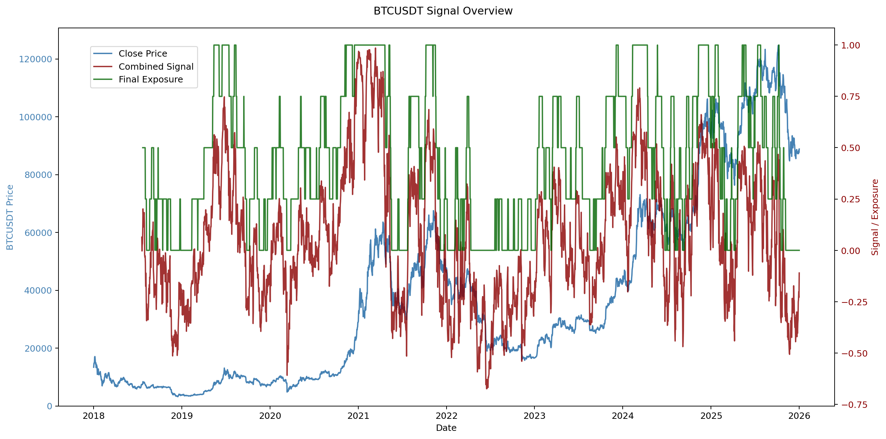
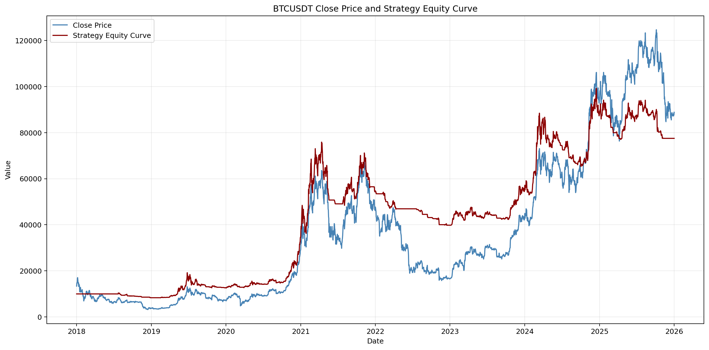

# BTC Scoring Bot

A small crypto signal and backtesting project that blends technical indicators with on-chain MVRV data to produce a simple BTC exposure model.

## What it does

- Pulls historical BTCUSDT candles from Binance
- Builds a small feature set from price, volume, momentum, and MVRV data
- Converts the combined signal into discrete exposure levels
- Backtests multiple exposure rules with transaction costs
- Saves portfolio-ready charts into `docs/assets/`

## Preview





## Project structure

- `scoring_bot.py` - main pipeline, feature engineering, backtest, and chart export
- `config/` - API key loading and local environment handling
- `exchange/` - Binance client setup
- `data/` - data helpers
- `mvrv_historic.json` - historical MVRV data used by the model
- `docs/assets/` - generated charts for the README

## Rebuild the charts

Run the main script after setting your Binance credentials in a local `.env` file:

```bash
python3 scoring_bot.py
```

This will regenerate the PNGs in `docs/assets/`.

## Notes

This is an educational backtest, not a trading recommendation. The point of the project is to show a complete workflow: data ingestion, feature engineering, signal construction, and performance reporting.
